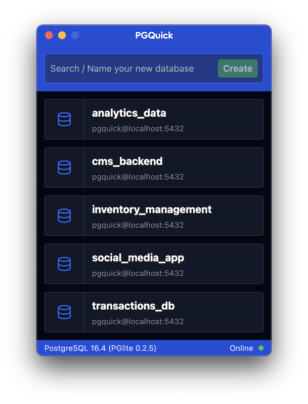

# PGQuick

### Full-featured, lightweight Postgres databases for local development.

PGQuick lets you spin up instant full-featured Postgres databases for your local development environment.
Built using the awesome [PGlite](https://pglite.dev) + [Electron](https://www.electronjs.org), and has all the [extensions](https://pglite.dev/extensions) that PGlite comes with enabled by default.

### PGQuick in action

